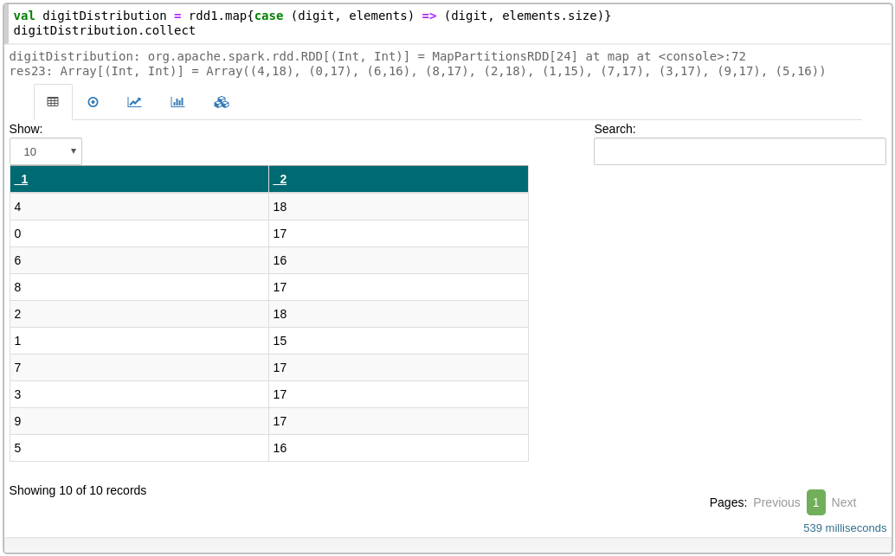
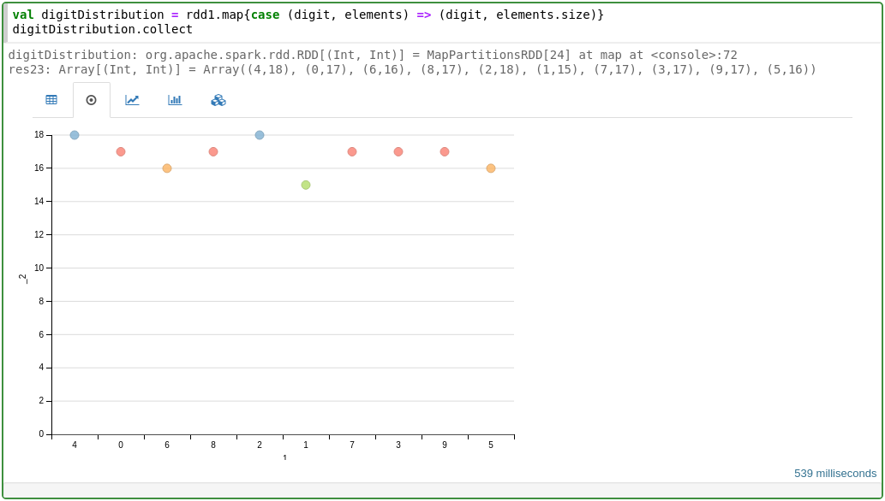
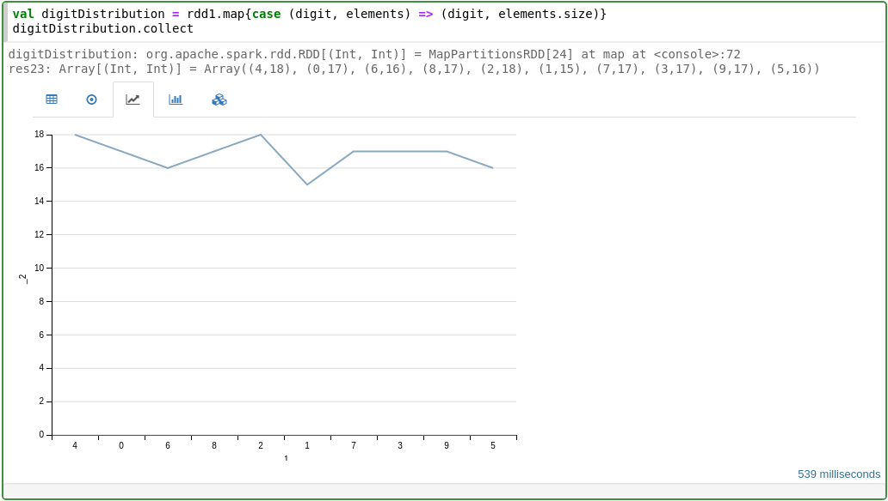
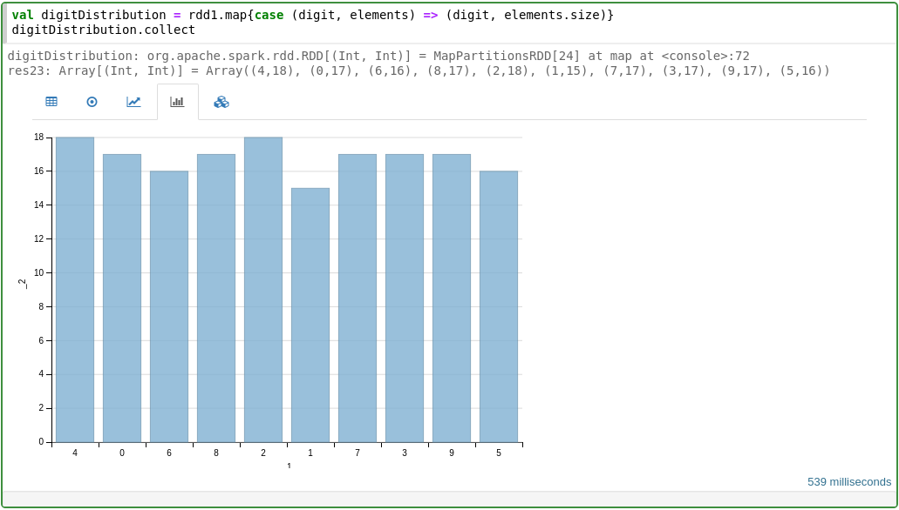
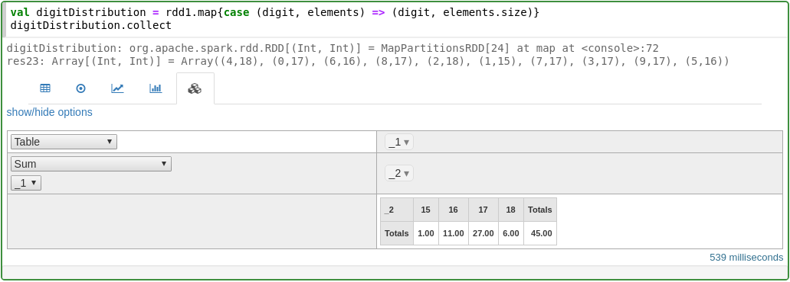
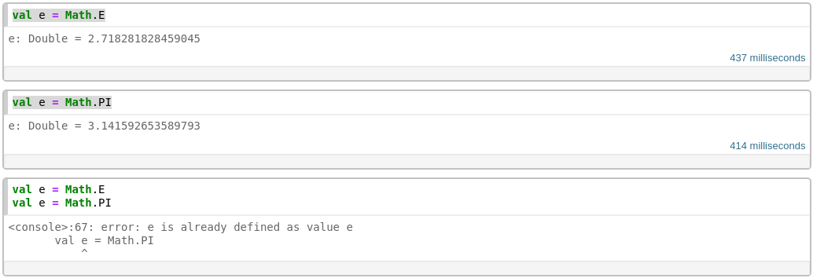

# Documentation

## Exploring the Notebook interface

For this introductory guide, we are, we are going to use [core/spark-101](http://localhost:9001/notebooks/core/Spark-101.snb)
*(for the links in this page to work, we assume that the Spark Notebook is running on localhost on the default port (9001))*

Click on the folder [core](http://localhost:9001/tree/core) and then click on the [spark-101](http://localhost:9001/notebooks/core/Spark-101.snb) notebook.

The Spark Notebook main abstraction is a _cell_. A cell can contain text, in the form of Markdown or Scala/Spark code.

Cells are editable. To enter edit mode, click on them or press enter when the cell is highlighted. 

Once you've edited a cell, pressing **&tl;Ctrl&gt;-Enter** will execute the cell and display the result in the output field within the cell, right below the edit area.

Once executed, the definitions within the cell become part of the execution context. Already defined elements can then be used in other cells, in order to interactively and gradually build up the desired logic.

 We can make use of the full spectrum of the Scala programming language: `imports`, `classes`,  `objects`, `values`, `variables`, `functions`, ..._ can be defined and used within the context of the notebook.

### Built-in Spark

The Spark Notebook is all about Spark. An implicit Spark context is built from the configuration and made directly available. With the Spark Notebook, you can start using Spark right away.

### Automatic visualizations

When data collections, like arrays, lists or sets, are returned from a cell, the Spark Notebook will offer automatic visualizations. The options will depend of the specific type of the data. For example, `case classes` will be displayed as text, tuples of 2 elements `(x,y)` will have chart representations like scatter plot, line charts or bar charts. Highly customized visualizations are possible using provided widgets.

#### Table

#### Scatter Plot

#### Line Chart

#### Bar Chart

#### Pivot Table

### Explore ...

Go through the complete notebook, changing and executing the cells. Experimentation is the best way to familiarize yourself with the notebook.

***

## A Note About Immutability

 The Scala Programming Language, as part of the family of functional programming languages, promotes immutability as an important programming principle. Furthermore, when programming for distributed computing, immutability plays a key role to achieve safe and consistent results. 
 The Spark Notebook fully supports the immutable principles of Scala. Although it's possible to re-execute a cell and update the values of `objects`, what are are doing is redefining those objects in the same context. __This should not be confused with value reassignment__ which will be safely rejected by the Scala compiler.

 Due to some limitations of the underlying REPL interpreter, assignments of different values to the same symbol in different cells will result in that symbol being redefined. Uniqueness of value assignments are only supported within the same cell.

