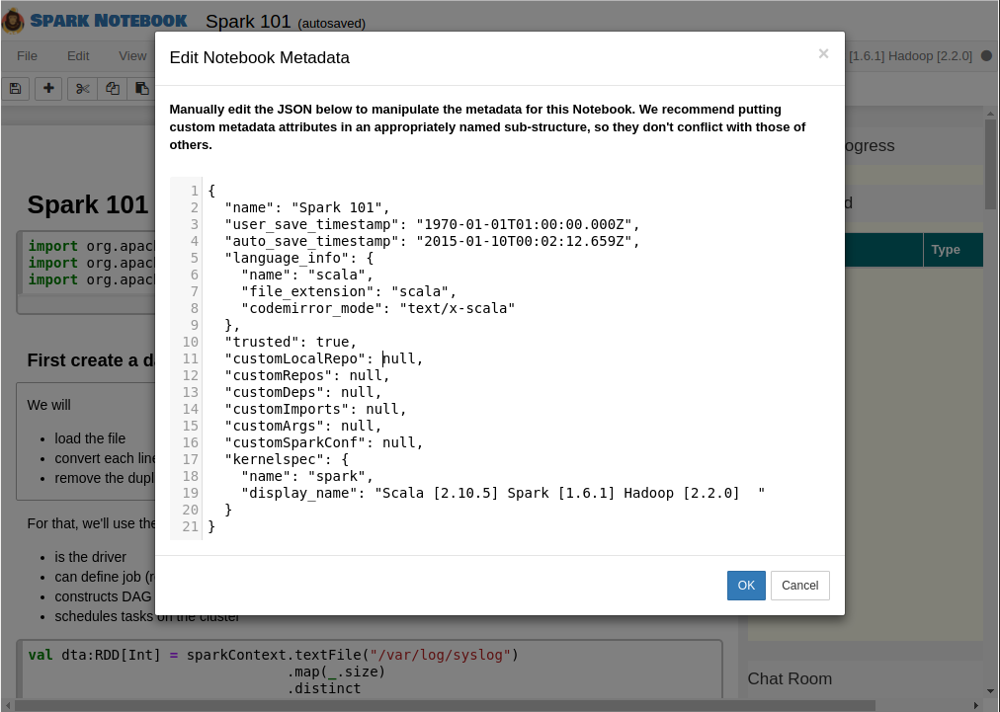

# Documentation

## The Notebook Metadata

The metadata in the notebook allows for the configuration of many runtime aspects of the Spark Notebook, the cluster it connects to (if any), specific library dependencies needed, JVM parameters and definition of variables that describe your environment.

By using the metadata we also free up the Notebook of configuration noise and lets us focus on the core aspects of our work.

To access the metadata, go to the menu "Edit" and pick the option "Edit Metadata", leading to the metadata dialog:



Most metadata content can be preconfigured and reused. See [Using **clusters**](using_cluster_tab.md) for more info on this feature.

### Set local repository
When adding dependencies, it can be interesting to preconfigure a repository where some dependencies have been already fetched.

This will save the dependency manager to download the internet.

```json
    "customLocalRepo" : "/<home>/.m2/repository",
```

### Add remote repositories

The default repositories are:
- Maven local repository (of the user account that launched the notebook server)
- Maven Central
- Spark Packages repository
- Typesafe repository
- JCenter repository

Additional repositories may be added in the "Notebook metadata":

```json
    "customRepos"     : [
      "s3-repo % default % s3://<bucket-name>/<path-to-repo> % maven % (\"$AWS_ACCESS_KEY_ID\", \"$AWS_SECRET_ACCESS_KEY\")"
    ],
```

### Import (download) dependencies

Adding dependencies in the classpath **and** in the spark context can be done, this way.

```json
    "customDeps"      : [
      "med-at-scale        %  ga4gh-model-java  % 0.1.0-SNAPSHOT",
      "org.apache.avro     %  avro-ipc          % 1.7.6",
      "- org.mortbay.jetty %  org.eclipse.jetty % _"
    ]
```

Alternatively, we can also use Maven coordinates:

```json
    "customDeps"      : [
      "med-at-scale:ga4gh-model-java:0.1.0-SNAPSHOT",
      "org.apache.avro:avro-ipc:1.7.6",
      "- org.mortbay.jetty:org.eclipse.jetty:_"
    ]
```

### Add Spark Packages

Spark Notebook supports the new Spark package repository at [spark-packages.org](http://spark-packages.org).  Include a package in
your notebook by adding its coordinates to the preconfiguration:

```json
    "customDeps"      : [
      "com.databricks:spark-avro_2.10:1.0.0"
    ]
```

### Default import statements

Some package, classes, types, functions and so forth could be automatically imported, by using:

```json
    "customImports"   : "import scala.util.Random\n",
```

### Add JVM arguments

Each notebook is actually running in a different JVM, hence you can add some parameters (like memory tuning and so on) like this:

```json
    "customArgs"   : [
      "-Dtest=ok",
      "-Dyarn.resourcemanager.am.max-attempts=1"
    ],
```

> **NOTE**:
> Don't add classpath arguments, e.g., `["-cp", "/path/to/foo.jar"]`, as this overrides the classpath, rather than adding jars to it.

### Spark Conf

Apache Spark needs some configuration to access clusters, tune the memory and [many others](http://spark.apache.org/docs/latest/configuration.html).

For this configuration to be shareable, and you don't want to use the `reset` functions, you can add:

```json
    "customSparkConf" : {
      "spark.app.name": "Notebook",
      "spark.master": "local[8]",
      "spark.executor.memory": "1G"
    }
```

### Custom Variables

Custom variables let us define common configuration values that permit us abstract out the Notebook logic from the system/environment where it's running in order to improve environment isolation and notebook portability across different installations.

Variables declared here become Scala constants in the notebook that are directly accessible from code.

e.g.

```json
   "customVars" : {
       "HDFS_ROOT" : "hdfs://server",
       "ACCOUNT_SERVER" : "http://server:port"
    }
```

These variables can be accessed from Scala code in the notebook:


### Example
```json
{
  "name": "My cluster conf",
  "profile": "Local",
  "template": {
    "customLocalRepo" : "/<home>/.m2/repository",
    "customRepos"     : [
      "s3-repo % default % s3://<bucket-name>/<path-to-repo> % (\"$AWS_ACCESS_KEY_ID\", \"$AWS_SECRET_ACCESS_KEY\")",
      "local % default % file://<home>/.m2/repository"
    ],
    "customDeps"      : "med-at-scale        %  ga4gh-model-java % 0.1.0-SNAPSHOT\norg.apache.avro     %  avro-ipc         % 1.7.6\n- org.mortbay.jetty % org.eclipse.jetty % _",
    "customImports"   : "import scala.util.Random\n",
    "customArgs"   : [ "-Dtest=ok", "-Dyarn.resourcemanager.am.max-attempts=1" ],
    "customSparkConf" : {
      "spark.app.name": "Notebook",
      "spark.master": "local[8]",
      "spark.executor.memory": "1G"
    },
     "customVars" : {
       "HDFS_ROOT" : "hdfs://server"
    }
  }
}
```

### ADAM configuration

Spark-notebook is often used by bionformaticians to analyze *omics data with ADAM genomics analysis platform. 
To works with ADAM you should add dependencies and also configure KryoSerializer to work with ADAMKryoRegistrator.

Here is an example of typical ADAM configuration 
```json
{
  "name": "hello-adam",
  "language_info": {
    "name": "scala",
    "file_extension": "scala",
    "codemirror_mode": "text/x-scala"
  },
  "trusted": true,
  "customDeps": [
    "org.bdgenomics.adam %% adam-core-spark2 % 0.21.0"
  ],
  "customImports": [
    "import org.bdgenomics.adam.rdd.ADAMContext._ \n",
    "import org.bdgenomics.adam.models._ \n",
    "import org.bdgenomics.adam.rdd.feature._ \n",
    "import org.bdgenomics.formats.avro._ \n"
  ],
  "customArgs": null,
  "customSparkConf": {
    "spark.app.name": "genetic-search",
    "spark.serializer": "org.apache.spark.serializer.KryoSerializer",
    "spark.kryo.registrator": "org.bdgenomics.adam.serialization.ADAMKryoRegistrator",
    "spark.kryoserializer.buffer.mb": "4",
    "spark.kryo.referenceTracking": "true"
  },
  "kernelspec": {
    "name": "spark",
    "display_name": "Scala [2.11.8] Spark [2.0.2] Hadoop [2.7.3] "
  }
}


