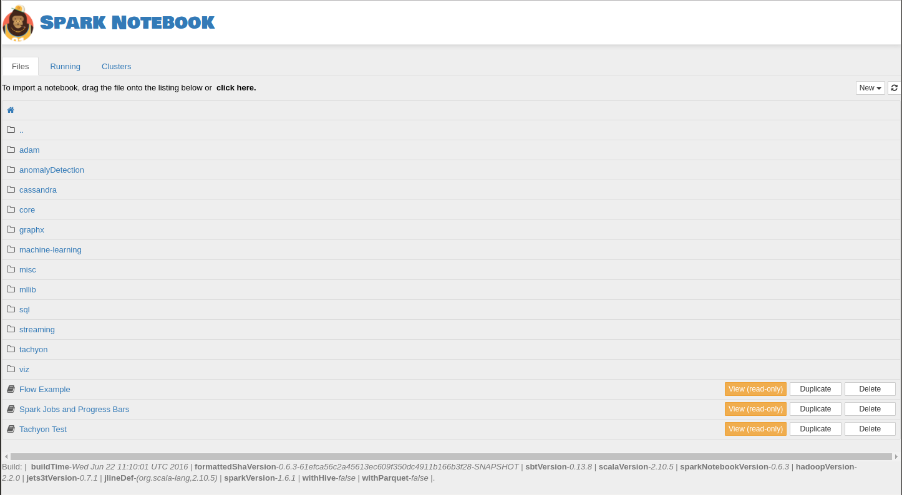

# Documentation

## Quick Start Guide

Start using the Spark Notebook in less than 5 minutes? Take these steps:

### Requirements:
* Make sure you are running at least Java 7 

### Steps
* Go to [spark-notebook.io](http://spark-notebook.io/)
	* Choose your release, spark version and additional packages according to your specific needs
		- Read more on: [Using Releases](using_releases.md)
	* If trying Spark for the first time, pick the latest release
* Download one of the packaged builds (TGZ or ZIP)
* Extract the file somewhere convenient
* Open a terminal/command window
* Change to the root directory of the expanded distribution
* Execute the command `bin/spark-notebook` (*NIX) or `bin\spark-notebook` (Windows)
* Open your browser to [localhost:9001](http://localhost:9001)

This procedure will launch a Notebook Server with the default configuration. If all went well, you will see the Notebook browser home page:

### Where to go from here?

* [Get familiar with the Spark Notebook](./exploring_notebook.md)
* Check out the supported widgets:
   * [HTML Widgets](./widgets_html.md)
   * [Visualization  Widgets](./widgets_viz.md)
* or learn how to create your own [custom visualizations](./custom_charts.md)  
* [Configure the notebook for your environment](./metadata.md)
* [Interact with the community](community.md)
* [Understand the Notebook browser](notebook_browser.md) 

See the [Index](./index.md) for a comprehensive topic list

### Up next: [Exploring the Notebook](./exploring_notebook.md)